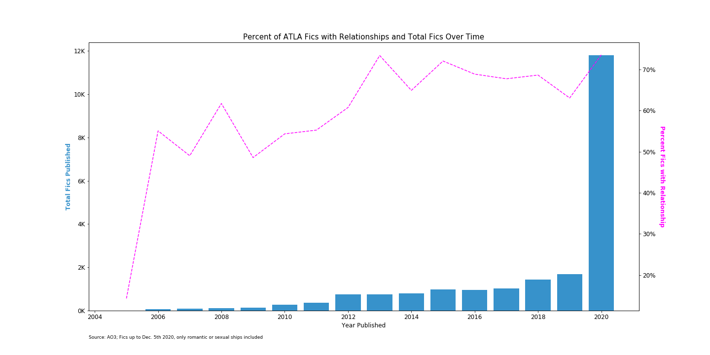
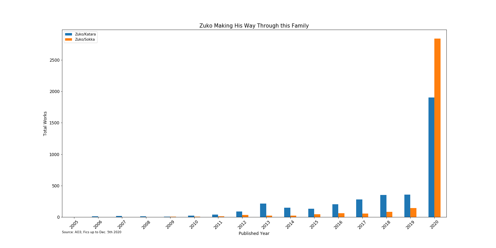

# <i>Avatar: The Last Airbender</i> AO3 Stats

On May 15th, 2020, Netflix added <i>Avatar: The Last Airbender</i> back to the platform. With much of the world still under lockdown, the popular Nickelodeon show saw a surge in popularity, welcoming both old and new fans, as demonstrated by the explosion of fanfiction published on the site [Archive of Our Own](https://archiveofourown.org/) (AO3). 

Through the resurgence, the percentage of fic tagged with a romantic or sexual relationship between characters in the show has remained high, just over 70%. 

Ever since I saw this [chord chart](https://www.futurephotons.io/ao3stats/) that visualizes the ships in Harry Potter AO3 fic, I'd been wanting to create my own, ideally for a multishipping fandom. A couple of my friends suggested <i>ATLA</i> and I was curious. Even though I've tragically never watched the show, through fandom osmosis, I was aware of its shipping wars. I mean, it's the example image on the TV Tropes page for [Ship-to-Ship Combat](https://tvtropes.org/pmwiki/pmwiki.php/Main/ShipToShipCombat) for crying out loud.  

After scraping all the <i>ATLA</i> AO3 fic as of December 5th, 2020 and filtering for ships with at least 50 occurrences, including only the the top two tagged ships per fic (see Notes), I was left with this chord chart between 24 total characters. 
 

Interactive version can be found [here](https://pharsaliam.github.io/ao3-vizzes/ATLA/atla_2020.html). 

I'll admit I was a little surprised by the results. From what I knew (and the cartoon above), I would have thought the chart would be dominated by a little triangle between Zuko, Katara, and Aang. But, it seems like Zuko himself is taking up the most real estate.  

What surprised me the most was the popularity of Zuko/Sokka, a ship I had never heard of before. Given the recent explosion of fic writing, I was curious if this was a new phenomenon, so I plotted the occurrence of Zuko/Sokka over time, compared to the just slightly more popular Zuko/Katara (Side note: this sibling rivalry has the vibe of an unfortunate /r/relationships post). 

While Zuko/Sokka has provided a decent showing over the years, it turns out that 2020 is the first year in which it overtook the juggernaut Zutara. 

Another demonstration of this phenomenon is the Tumblr Fandometrics [2020′s Top Ships](https://fandom.tumblr.com/post/636856116682375168/2020-top-ships) list released earlier in December where Zuko/Sokka made it to 6th place, while Zuko/Katara placed 19th. Both ships did not make it onto the 2019 list. 

---

## Notes

**How did you make the chord chart?**  
I used Shahini Rostami's [chord generator](https://github.com/shahinrostami/chord) package. 

**Why only include the top two ships tagged on each fic?**  
I only wanted to include main ships in a fic, not side ships, assuming that ships are tagged in order of importance. Over 70% of fics had two or fewer ships tagged. 

---
Last Updated: December 23rd, 2020 